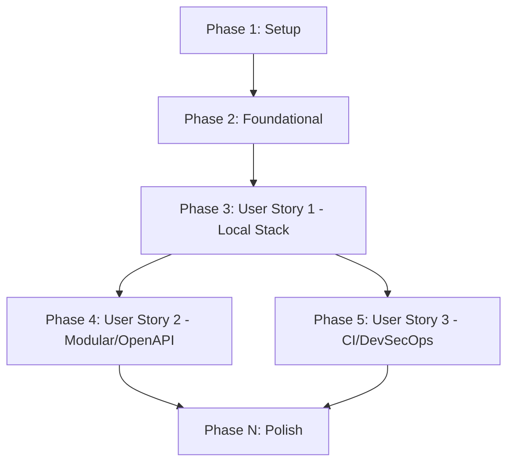

# Tasks: Project Base Setup

**Input**: Design documents from `/specs/001-project-base-setup/`

**Prerequisites**: plan.md (required), spec.md (required for user stories), research.md, data-model.md, contracts/

**Organization**: Tasks are grouped by user story to enable independent implementation and testing of each story.

## Format: `[ID] [P?] [Story] Description`

- **[P]**: Can run in parallel (different files, no dependencies)
- **[Story]**: Which user story this task belongs to (e.g., US1, US2, US3)
- Include exact file paths in descriptions

## Path Conventions

- **Web app**: `backend/`, `frontend/`, `gateway/`

## Phase 1: Setup (Shared Infrastructure)

**Purpose**: Initial monorepo file structure and framework setup.

- [x] T001 Create project directories at backend/, frontend/, gateway/, and .github/
- [x] T002 Initialize Go modules and basic server in backend/go.mod and backend/cmd/server/main.go
- [x] T003 Initialize Next.js project with TypeScript config in frontend/tsconfig.json and frontend/package.json
- [x] T004 [P] Configure backend and frontend linter rules in backend/.golangci.yml and frontend/.eslintrc.json

---

## Phase 2: Foundational (Blocking Prerequisites)

**Purpose**: Shared infrastructure and configurations required before implementing any user journeys.

**⚠️ CRITICAL**: No user story work can begin until this phase is complete.

- [x] T005 Create docker-compose.yml at the repository root
- [x] T006 Configure Traefik gateway router settings in gateway/traefik.yml
- [x] T007 Setup environment variable loaders in backend/internal/adapter/config/config.go

**Checkpoint**: Foundation ready - user story implementation can now begin.

---

## Phase 3: User Story 1 - Local Development Environment (Priority: P1) 🎯 MVP

**Goal**: Seamless local execution of all database, caching, frontend, backend, and gateway services using Docker Compose.

**Independent Test**: Spin up the environment using `docker compose up` and access backend health checks and frontend initial pages.

### Implementation for User Story 1
- [x] T008 [US1] Implement database client connection in backend/internal/adapter/db/postgres.go
- [x] T009 [US1] Implement cache client connection in backend/internal/adapter/cache/redis.go
- [x] T010 [US1] Create HTTP health check handler in backend/internal/adapter/http/health.go
- [x] T011 [US1] Build system status dashboard UI in frontend/src/app/page.tsx
- [x] T012 [US1] Validate local startup and routing via Traefik in docker-compose.yml

**Checkpoint**: At this point, the local monorepo development stack is fully functional and testable.

---

## Phase 4: User Story 2 - Modular & Contract-Driven Structure (Priority: P2)

**Goal**: Enforce backend Clean Architecture layers and generate frontend TypeScript clients from a central OpenAPI schema.

**Independent Test**: Change the OpenAPI contract, generate the TypeScript SDK, and run client queries inside Next.js components.

### Implementation for User Story 2
- [x] T013 [US2] Save the central OpenAPI schema to openapi.yaml at the repository root
- [x] T014 [US2] Configure automated frontend client generation in frontend/orval.config.js
- [x] T015 [US2] Implement user authentication and profile adapters in backend/internal/adapter/http/user.go
- [x] T016 [US2] Generate TypeScript API clients in frontend/src/services/api/
- [x] T017 [US2] Connect frontend login component to API client in frontend/src/components/Login.tsx

**Checkpoint**: User Story 2 is functional and integrated with backend auth routes.

---

## Phase 5: User Story 3 - Automated Quality & Security Pipelines (Priority: P3)

**Goal**: Automated unit testing, linting, SAST analysis, and container vulnerability checks run on every PR/commit.

**Independent Test**: Trigger the GitHub Actions CI pipeline and confirm all quality gates verify clean execution.

### Implementation for User Story 3
- [x] T018 [US3] Create backend API unit tests in backend/internal/adapter/http/health_test.go
- [x] T019 [US3] Create frontend dashboard unit tests in frontend/src/app/page.test.tsx
- [x] T020 [P] [US3] Configure Trivy container scan jobs in .github/workflows/ci.yml
- [x] T021 [P] [US3] Configure SAST scanner jobs in .github/workflows/ci.yml
- [x] T022 [US3] Write GitHub Actions integration pipeline in .github/workflows/ci.yml
- [x] T023 [US3] Verify CI pipeline execution behavior on a test PR

**Checkpoint**: Quality gates are active and fail-safe.

---

## Phase N: Polish & Cross-Cutting Concerns

**Purpose**: Code cleanup, optimization, and documentation.

- [x] T024 Update project setup guide in README.md
- [x] T025 Implement secret validation tests in backend/internal/adapter/config/config_test.go
- [x] T026 Optimize docker build steps in backend/Dockerfile and frontend/Dockerfile

---

## Dependencies & Execution Order

### Phase Dependencies

- **Setup (Phase 1)**: Can start immediately.
- **Foundational (Phase 2)**: Depends on Setup. Blocks all User Stories.
- **User Story 1 (P1)**: Depends on Foundational.
- **User Story 2 (P2)**: Depends on User Story 1.
- **User Story 3 (P3)**: Depends on User Story 1 (requires working service tests).
- **Polish (Phase N)**: Depends on completion of all stories.

### Parallel Opportunities

- Setup tasks marked `[P]` (T004) can run in parallel with initialization.
- Once User Story 1 completes, work on User Story 2 (Contract integration) and User Story 3 (CI pipelines) can proceed in parallel.
- Linter, test, SAST and Trivy actions config (`[P]` tasks T020, T021) can be defined concurrently.

---

## Implementation Strategy

### MVP First (User Story 1 Only)

1. Complete Setup and Foundational setup.
2. Complete User Story 1.
3. Validate local environment stability (docker compose logs show no errors, HTTP health check endpoints respond with 200).

### Incremental Delivery

1. Setup + Foundation: base directories, base docker compose.
2. User Story 1: postgres, redis connection initializers, Traefik local routing rules.
3. User Story 2: OpenAPI client generation and Clean Architecture layers.
4. User Story 3: CI actions pipelines for linting, testing, SAST, and Trivy container scanning.
